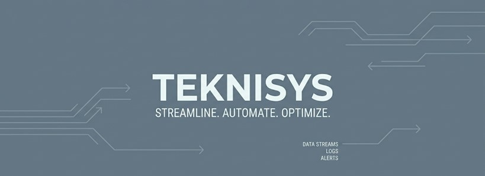

## 🏢 About The Project
TEKNISYS is a comprehensive property management platform specifically designed for apartment buildings and commercial offices. Born from real-world experience as an Engineering Admin, this system bridges operational gaps between engineering teams, housekeeping staff, and building management through intelligent workflow automation.

## 🌟 Why TEKNISYS Exists
Traditional property management often relies on WhatsApp messages, paper trails, and manual Excel sheets. TEKNISYS transforms this chaos into a streamlined digital workflow, ensuring no maintenance request gets lost, no overtime goes unrecorded, and every asset is tracked efficiently.
